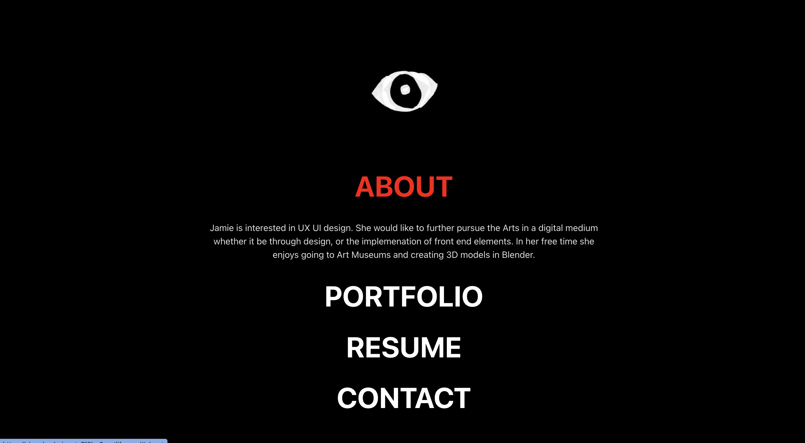

# My Portfolio

This is my personal portfolio built using React.js and Vite.

## Table of Contents

- [Demo](#demo)
- [Features](#features)
- [Getting Started](#getting-started)
  - [Prerequisites](#prerequisites)
  - [Installation](#installation)
- [Usage](#usage)
- [Deployment](#deployment)
- [Built With](#built-with)
- [License](#license)

## Demo

A live demo of the portfolio is available at https://singular-beignet-7f2be8.netlify.app/

## Features

- Clean and modern design
- Responsive layout
- [React.js](https://reactjs.org/) for building UI components
- [Vite](https://vitejs.dev/) for fast and efficient development
- Easy customization

## Getting Started

### Prerequisites

Make sure you have [Node.js](https://nodejs.org/) and [npm](https://www.npmjs.com/) installed on your machine.

### Installation

1. Clone the repository:
git clone https://github.com/jamu-bu/react-port
Navigate to the project directory:

Install dependencies:
npm install

## Usage
To start the development server, run:
npm run dev
Open http://localhost:5173 in your browser to view the portfolio.

click the closed eye image to see the information on the page

this is the true homepage, hovering over the navlink will change fontcolor to red

clicking on the navlink will display the page component

## Customization
Feel free to customize the content, styles, and components to suit your preferences. Update the information in the src/data directory to reflect your own skills, projects, and contact details.

## Deployment
To build the production-ready bundle, run:
npm run build
This will generate a dist folder containing the optimized and minified assets. You can deploy this folder to your hosting provider of choice.

## Built With
React.js - A JavaScript library for building user interfaces
Vite - A fast development server and bundler

## License
This project is licensed under the MIT License - see the LICENSE file for details.

- [@vitejs/plugin-react](https://github.com/vitejs/vite-plugin-react/blob/main/packages/plugin-react/README.md) uses [Babel](https://babeljs.io/) for Fast Refresh
- [@vitejs/plugin-react-swc](https://github.com/vitejs/vite-plugin-react-swc) uses [SWC](https://swc.rs/) for Fast Refresh
